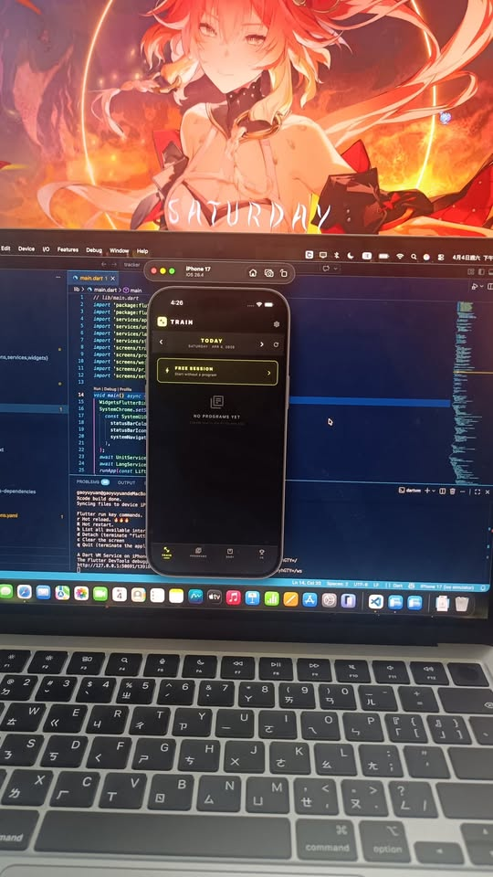

# 🏋️ LIFT - 你的專屬訓練追蹤器

> **這是一個為了讓你在健身房更專注而設計的 App。**

---

## 🚀 立即體驗 (iOS / Android / Web)

如果你想在 iPad 或 iPhone 上像 App 一樣使用，請點擊下方網址：

### 👉 [點我開啟 LIFT 網頁版](https://hogrider-999.github.io/LIFT/)

---

## 📱 如何在 iPad/iPhone 上「安裝」？

為了獲得最佳體驗，建議將網頁加入主畫面，這樣就不會有瀏覽器網址列：

1. 使用 **Safari** 瀏覽器開啟上面的網址。
2. 點擊螢幕上方的 **「分享」** 圖示 (正方形帶箭頭 ⬆️)。
3. 向下捲動並選擇 **「加入主畫面 (Add to Home Screen)」**。
4. 點擊 **「新增」**，LIFT 就會出現在你的桌面上了！

---

## 🛠️ 開發細節
- **Framework**: Flutter Web
- **功能**: 訓練數據紀錄、分頁切換、深色模式介面。# 🏋️ LIFT - 你的專屬訓練追蹤器

> **這是一個為了讓你在健身房更專注而設計的 App。**

---

## 🚀 立即體驗 (iOS / Android / Web)

如果你想在 iPad 或 iPhone 上像 App 一樣使用，請點擊下方網址：

### 👉 [點我開啟 LIFT 網頁版](https://hogrider-999.github.io/LIFT/)

---

## 📱 如何在 iPad/iPhone 上「安裝」？

為了獲得最佳體驗，建議將網頁加入主畫面，這樣就不會有瀏覽器網址列：

1. 使用 **Safari** 瀏覽器開啟上面的網址。
2. 點擊螢幕上方的 **「分享」** 圖示 (正方形帶箭頭 ⬆️)。
3. 向下捲動並選擇 **「加入主畫面 (Add to Home Screen)」**。
4. 點擊 **「新增」**，LIFT 就會出現在你的桌面上了！

---

## 🛠️ 開發細節
- **Framework**: Flutter Web
- **功能**: 訓練數據紀錄、分頁切換、深色模式介面。
